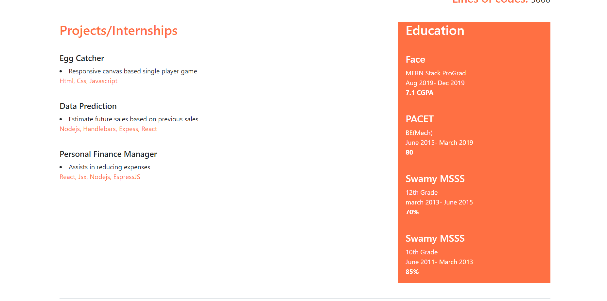

# Resumer
This is an resumer application that builds resume by getting details from user.

## Authors:
Jashwanthi V

## Technologies used
React Js, Express, Node JS, JSX, Mongodb, Bootstrap.

## Objective
Create a resumer application.

## Guidelines
1. When you open the app, you can see view resume and add resume menu.
2. Click on the add resume and enter all the details in the form.
3. Now, click view resume to view your resume.

## Watch video
https://youtu.be/6Z19zsqEqu4

## Images

1. When the application is opened, it shows the list of resumes available in the database

2. Clicking on the 'View' button opens the resume of the particular person

3. Resume scroll

4. When the 'Add Resume' button is clicked, it opens the form section

5. Form scroll

